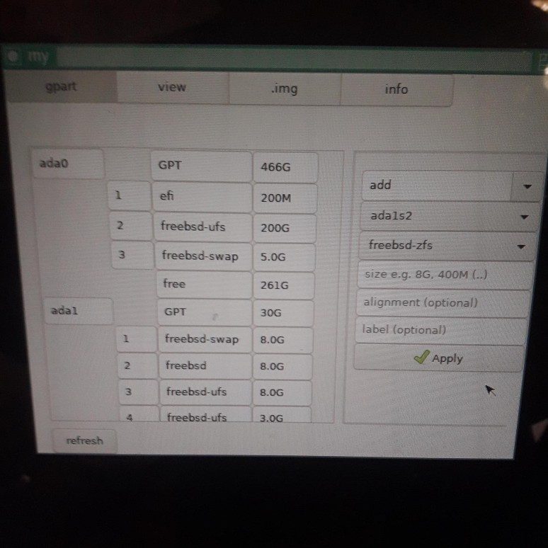

# partition editor

This is a GUI partition editor for FreeBSD.

It runs in a window manager of your choice (gnome, lxde, ...).
It uses gtk3, so you need pkg install gtk3.

It currently includes:

- view disks, partitions, slices, disk labels, and device names
- create/destroy disks or slices, add, remove, modify, resize partitions
- set labels or attributes
- write .img files to disk (with optional sha checksum checking)
- add file systems (ufs, ntfs)

How to use this:
- Download the files into a folder
- cd into that folder
- type "make"
- type "./my" 
- enjoy the GUI :-)

