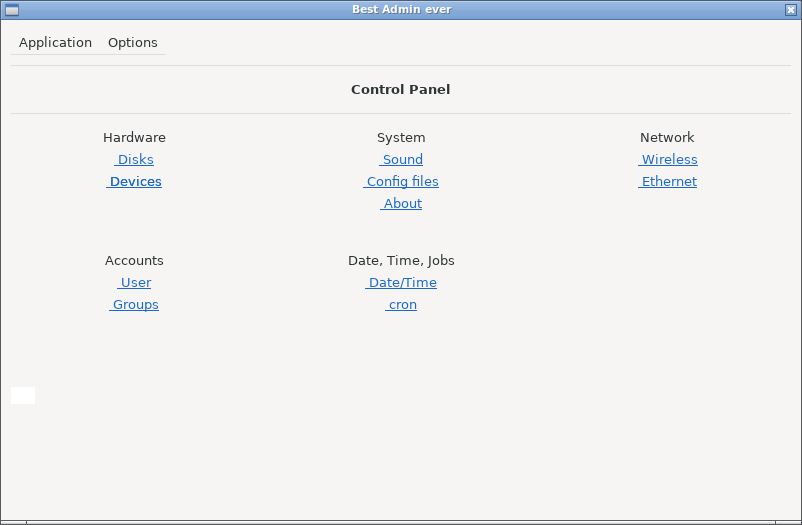
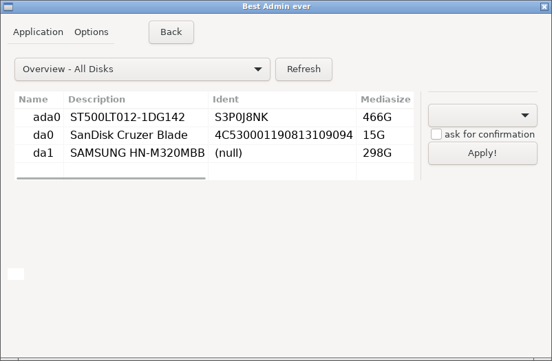

------------------------
brut
------------------------

-----------------------
FAQ
-----------------------

1. What is brut? 
A standalone GUI (graphical user interface) for admin tasks in FreeBSD, e.g. disk partitioning.  
2. Screenshots: 
Main view: 

 Partition Editor: 

--------------------------
3. What are the dependencies? 
gtk3 and sudo. "pkg install gtk3" is recommended, since that one is large.  
--------------------------

4. Is it safe?  
In general, it translates mouse clicks into shell commands. 
Start it as a regular user. For root commands, it has a sudo(8) backend. 
The password is piped to sudo via a named pipe (there is no other way). You can change 
sudo behavior if you edit its configuration file /usr/local/etc/sudoers. 
Currently there are no plans to use polkit.  

--------------------------
5. How do I install it? 
*edit: brut is now officially a port. So at some point, "pkg install brut" will do.

Install it just like any other port: 
- Make sure you have /usr/ports directory. 
- Download ports/Makefile and ports/pkg-descr 
- Run "make makesum" and "make install clean" 
- (recommended: Run "dbus-uuidgen --ensure", for dbus) 
- The start command is: brut :)  

Or build as a standalone binary: 
1. Download the source files.
2. Make sure you have gtk3 and sudo installed. 
3. Run "make LOCALBASE=/usr/local" 
4. Start the binary (./brut).  

If there is a need for it, I can also add binaries.

--------------------------
