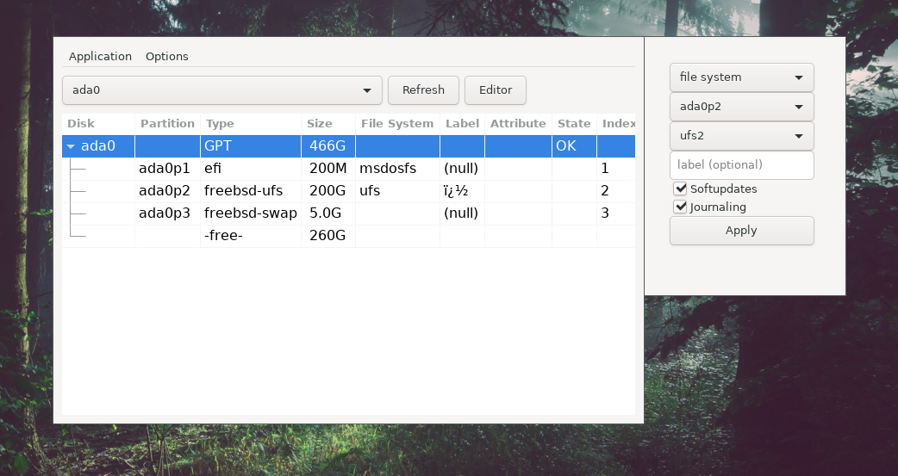

------------------------
xdisk
------------------------

-----------------------
FAQ
-----------------------

1. What is xdisk? 
xdisk is a partition editor for FreeBSD with a graphical user interface.  

2. How does it look? 

2. What can I do with it? 
You can.. 
   - inspect hard disks, memory cards, sd cards 
   - create/destroy partitioning schemes 
   - add/remove/modify partitions 
   - mount/unmount 
   - create file systems  

3. What are the dependencies? 
gtk3 and sudo. "pkg install gtk3" is recommended.  

4. Is it safe?  
Start xdisk as regular user. For root commands, it has sudo(8) backend. 
Password is piped to sudo via named pipe. You can change  
sudo behavior by editing its configuration file /usr/local/etc/sudoers.  

5. How do I install xdisk? 
Install it as a port: 
- Download ports/Makefile and ports/pkg-descr 
- Run "make makesum" and "make install clean" 
- (recommended: Run "dbus-uuidgen --ensure", for dbus) 
- Start it with xdisk :)  

Or build as a standalone binary: 
1. Download the source files (without the /ports folder). I will add a tarball in the future.
2. Make sure you have gtk3 and sudo installed. 
3. Run "make LOCALBASE=/usr/local" 
4. Start the binary (./xdisk).  

6. How to uninstall? 
run "pkg remove xdisk"  
