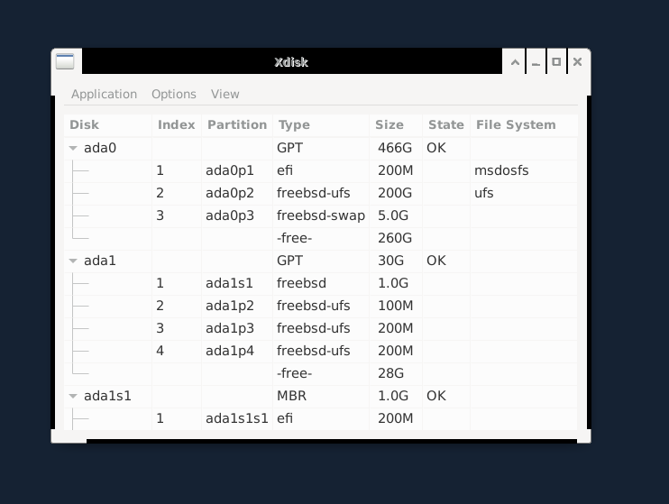
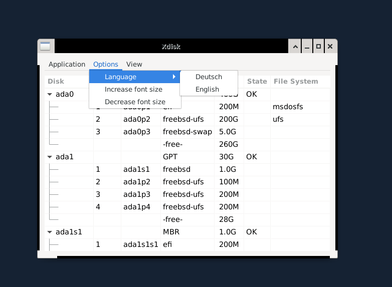
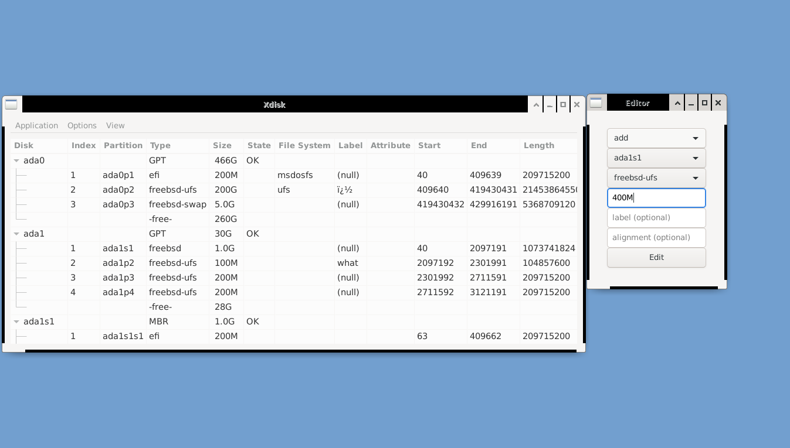

------------------------
xdisk
------------------------

Q: What is xdisk? 
A: xdisk is a GUI for editing hard drives on FreeBSD (partition editor, disk editor).

Q: What are the dependencies?
A: It uses gtk3 ("pkg install gtk3" is recommended). Other than that, it only uses
system tools (e.g. geom, gpart).

Q: How do I install it?
A: Install it as a port:
1. Download ports/Makefile and ports/pkg-descr
2. Run "make makesum" and "make install clean"
3. (recommended: Run "dbus-uuidgen --ensure")
4. Start it with xdisk :)

Q: How to uninstall?
A: run "pkg remove xdisk"

Q: Is it safe? 
A: Yes. It carefully translates mouse clicks into gpart commands.

