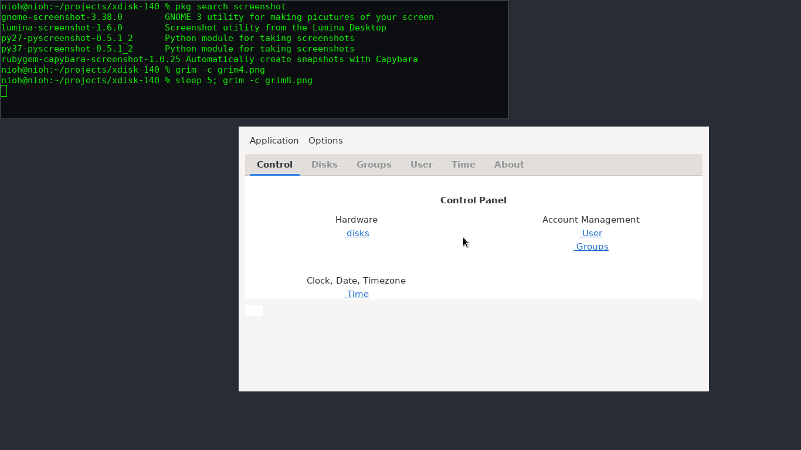
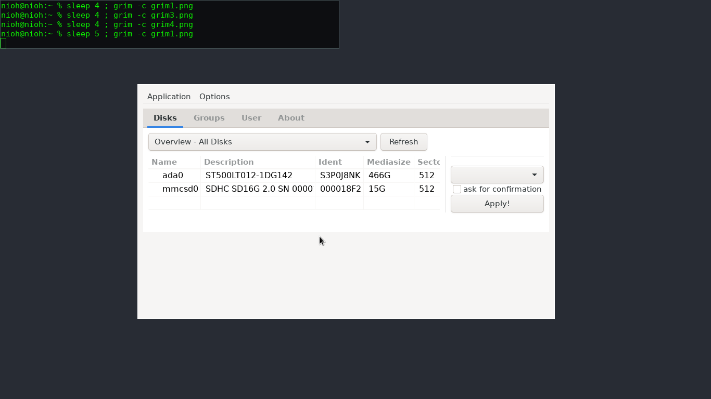
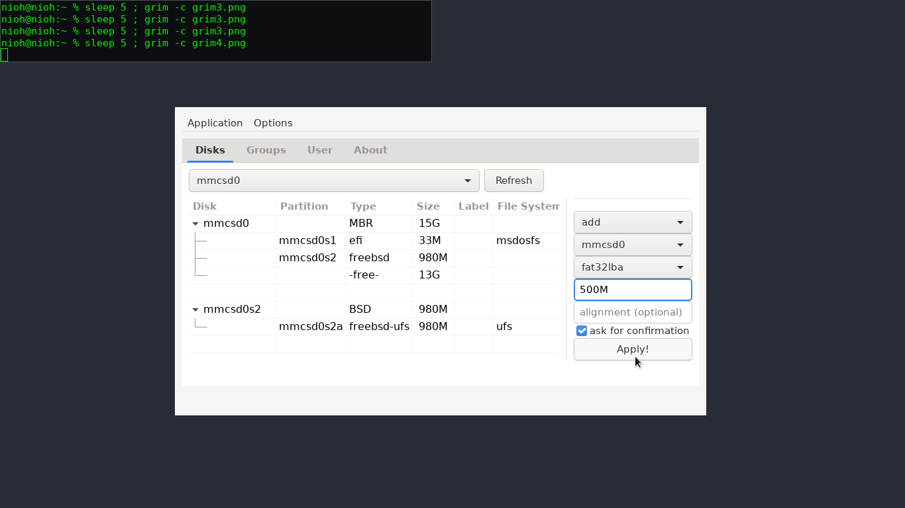

------------------------
brut
------------------------

-----------------------
FAQ
-----------------------

1. What is brut? 
A graphical user interface (GUI) for various admin tasks in FreeBSD.  
Among its features are: 
- disk editor, partition editor 
- manage users/groups 
- set time and timezone 

2. How does it look? 

Screenshots in wayland/hikari:

3. What are the dependencies? 
gtk3 and sudo. "pkg install gtk3" is recommended, since that one is large.  

4. Is it safe?  
In general, it translates mouse clicks into shell commands. 
Start it as a regular user. For root commands, it has a sudo(8) backend. 
The password is piped to sudo via a named pipe (there is no other way). You can change 
sudo behavior by editing its configuration file /usr/local/etc/sudoers. 
Currently there are no plans to use polkit.  

5. How do I install it? 
Install it just like any other port: 
- Download ports/Makefile and ports/pkg-descr 
- Run "make makesum" and "make install clean" 
- (recommended: Run "dbus-uuidgen --ensure", for dbus) 
- The start command is: brut :)  

Or build as a standalone binary: 
1. Download the source files (without the /ports and /screenshots folder). I will add a tarball in the future.
2. Make sure you have gtk3 and sudo installed. 
3. Run "make LOCALBASE=/usr/local" 
4. Start the binary (./brut).  

6. How to uninstall? 
run "pkg remove brut".  
